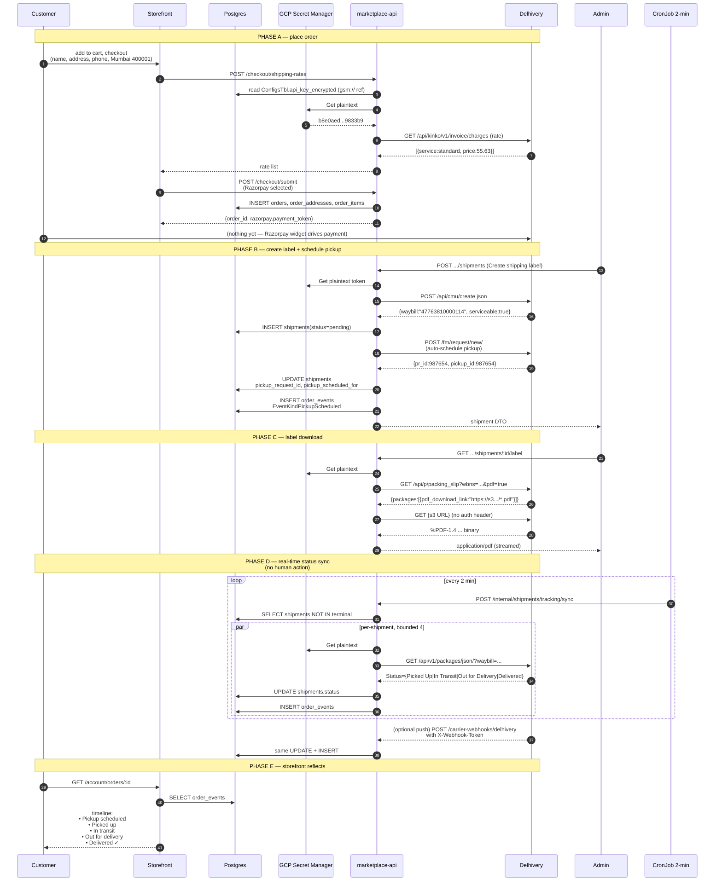
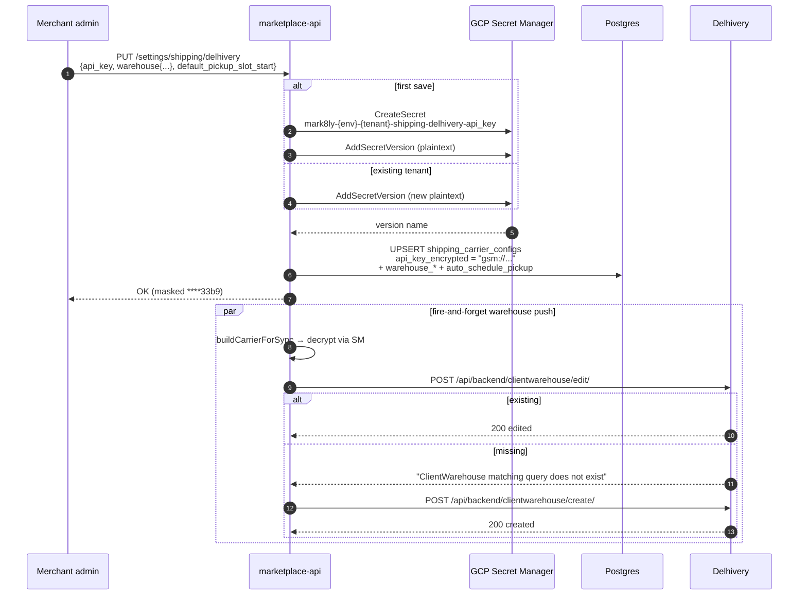
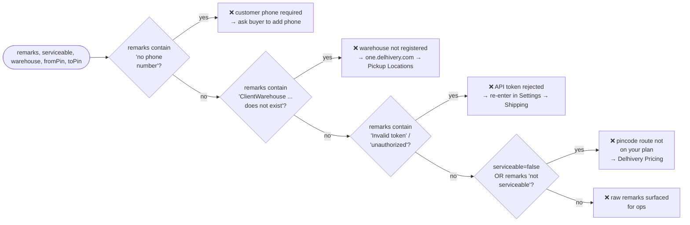
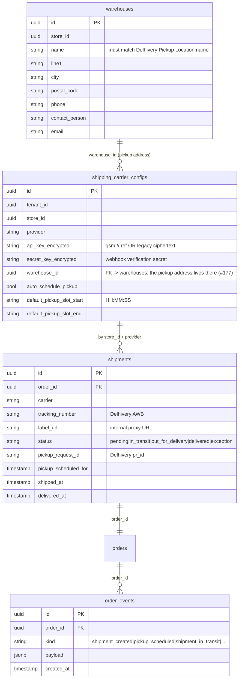

# Delhivery integration — architecture & flows

Master document for the mark8ly ↔ Delhivery shipping integration.
Covers credential storage, the full happy-path journey from checkout
through delivery, and every failure mode the code classifies.

Cross-references:
- Pickup scheduling detail: [`delhivery-pickup.md`](./delhivery-pickup.md)
- Webhook receiver detail: [`delhivery-webhook.md`](./delhivery-webhook.md)
- Provider-agnostic carrier code: `services/marketplace-api/internal/shipping/`

> **Relationship to the system design diagram.** `docs/mark8ly.drawio`
> covers the platform at large but does not break out the
> carrier-credentials / tracking-sync paths. The Mermaid diagrams in
> this doc are the source of truth for the shipping integration until
> the draw.io is refreshed; any change to the flow belongs here first.

---

## 1. Component architecture

```mermaid
flowchart TB
    subgraph Customer["👤 Customer"]
        CustomerBrowser[Storefront browser]
    end

    subgraph Storefront["🛒 Storefront pod (marketplace-api, MODE=storefront)"]
        CheckoutHandler[POST /checkout/submit]
        RatesHandler[POST /checkout/shipping-rates]
        OrderTimeline[GET /account/orders/:id<br/>timeline poll + tab-focus refresh]
    end

    subgraph AdminUI["🧑‍💼 Admin browser"]
        AdminShipmentPanel[Shipment panel<br/>Create / Download / Email /<br/>Refresh / Reschedule / Delete]
        AdminSettings[Settings → Shipping]
    end

    subgraph Admin["⚙️ Admin pod (marketplace-api, MODE=admin)"]
        ShipmentsHandler[ShipmentsHandler]
        SettingsHandler[ShippingSettingsHandler]
        WebhookEndpoint[/POST /carrier-webhooks/delhivery/]
        InternalSync[POST /internal/shipments/tracking/sync]
    end

    subgraph Cluster["🔄 Cluster-internal"]
        CronJob["CronJob */2min<br/>curls internal sync"]
    end

    subgraph SM["🔐 GCP Secret Manager"]
        SMSecret["mark8ly-{env}-{tenant}-<br/>shipping-delhivery-api_key"]
    end

    subgraph DB["🗄️ Postgres mark8ly_marketplace_api"]
        ShipmentsTbl[(shipments)]
        ConfigsTbl[(shipping_carrier_configs)]
        EventsTbl[(order_events)]
    end

    subgraph Delhivery["📦 Delhivery API"]
        DLCreate["/api/cmu/create.json"]
        DLTrack["/api/v1/packages/json/"]
        DLPickup["/fm/request/new/"]
        DLLabel["/api/p/packing_slip"]
        DLWarehouse["/api/backend/clientwarehouse/"]
        DLWebhookOut["(push) Post Webhook"]
    end

    CustomerBrowser --> CheckoutHandler
    CustomerBrowser --> RatesHandler
    CustomerBrowser --> OrderTimeline
    OrderTimeline --> EventsTbl

    AdminShipmentPanel --> ShipmentsHandler
    AdminSettings --> SettingsHandler

    SettingsHandler -->|Put plaintext| SMSecret
    SettingsHandler -->|ref string| ConfigsTbl
    SettingsHandler -.->|async push<br/>UpsertWarehouse| DLWarehouse

    ShipmentsHandler -->|ref| ConfigsTbl
    ShipmentsHandler -->|Get plaintext| SMSecret
    ShipmentsHandler --> DLCreate
    ShipmentsHandler --> DLPickup
    ShipmentsHandler --> DLLabel
    ShipmentsHandler --> DLTrack
    ShipmentsHandler --> ShipmentsTbl
    ShipmentsHandler --> EventsTbl

    RatesHandler -->|Get plaintext| SMSecret
    RatesHandler --> DLCreate

    CronJob -->|X-Internal-Auth| InternalSync
    InternalSync -->|every open shipment| DLTrack
    InternalSync --> ShipmentsTbl
    InternalSync --> EventsTbl

    DLWebhookOut -->|on every scan| WebhookEndpoint
    WebhookEndpoint --> ShipmentsTbl
    WebhookEndpoint --> EventsTbl

    style SMSecret fill:#fef3c7,stroke:#f59e0b
    style DLCreate fill:#dbeafe,stroke:#3b82f6
    style DLTrack fill:#dbeafe,stroke:#3b82f6
    style DLPickup fill:#dbeafe,stroke:#3b82f6
    style DLLabel fill:#dbeafe,stroke:#3b82f6
    style DLWarehouse fill:#dbeafe,stroke:#3b82f6
    style DLWebhookOut fill:#dbeafe,stroke:#3b82f6
```

### Trust & IAM boundaries

| Layer | Credential | Lives in | IAM |
|---|---|---|---|
| Encryption key (envelope) | `ENCRYPTION_KEY` | GCP SM secret `prod-marketplace-encryption-key` | Service SA only |
| Per-tenant Delhivery token | plaintext, one version per rotation | GCP SM secret `mark8ly-{env}-{tenant}-shipping-delhivery-api_key` | `app-secrets-marketplace-prod@...` SA with `roles/secretmanager.admin` (prefix-scoped in the IAM condition) |
| Reference string in DB | `gsm://projects/.../secrets/...` | `shipping_carrier_configs.api_key_encrypted` | Postgres role `marketplace_api` |
| Internal sync endpoint | `X-Internal-Auth` header | K8s Secret `mark8ly-marketplace-api-internal-auth` | Cluster-internal only |
| Delhivery webhook secret | per-tenant `secret_key_encrypted` | same column path as API key | verified on every call |

The `HybridStore` auto-provisioning means every new merchant's
credential becomes a new GCP SM secret on their first save — no
Terraform, no operator ticket.

---

## 2. End-to-end happy-path sequence

---

## 3. Settings flow — per-tenant credential onboarding

Notes:

- The warehouse push is **detached** (goroutine, 30s context) — a
  Delhivery outage never fails the admin save.
- The secret name includes the tenant UUID so two merchants never
  share a secret even if they both register provider `delhivery`.
- Masked display at the top of the settings form decrypts through
  the store and shows the last 4 of plaintext — never ciphertext.

---

## 4. Error classification ladder

All Delhivery `POST /cmu/create.json` failures land in
`classifyDelhiveryCreateError`. The order matters — specific remarks
win over the generic serviceable flag:

Each branch is pinned by a unit test in
`internal/shipping/delhivery_test.go` so the order cannot silently
regress.

---

## 5. Database schema (shipping-relevant columns)

> The pickup address used to be 8 `warehouse_*` columns on
> `shipping_carrier_configs`, duplicated per carrier. #177 moved it to the
> store-level `warehouses` table, #486 moved every reader onto
> `warehouse_id`, and migration 000117 dropped the old columns.

Schema DDL lives in
`tesserix-k8s/charts/apps/db-schema-bootstrap/schemas/marketplace/marketplace/`.
The `db-schema-bootstrap` CronJob re-applies it every 30 minutes,
idempotent via `ADD COLUMN IF NOT EXISTS`.

---

## 6. Every moving piece — quick-reference table

| Surface | Where | Triggered by |
|---|---|---|
| Envelope encryption wrapper | `internal/carriersecrets/store.go` | all carrier-credential reads + writes |
| GCP SM backend | `internal/carriersecrets/gcp.go` | `SHIPPING_SECRET_STORE=gcpsm` |
| OpenBao backend | `internal/carriersecrets/bao.go` | `SHIPPING_SECRET_STORE=bao` (a `gcpsm` deployment can still hold already-migrated `bao://` rows — see below) |
| Delhivery carrier client | `internal/shipping/delhivery.go` | admin label flow, storefront rates, sync, webhook |
| Admin settings handler | `internal/handlers/admin/settings.go` | PUT `/settings/shipping/:provider` |
| Auto warehouse-sync push | same file, `syncWarehouseAsync` | post-save, fire-and-forget |
| Shipment create | `internal/handlers/admin/shipments.go` Create | "Create shipping label" button |
| Auto-pickup on create | same file, `tryAutoSchedulePickup` | inside Create after label persists |
| Manual pickup reschedule | `POST .../pickup/schedule` | "Reschedule pickup" button |
| Label download | `GET .../label` | "Download label" button |
| Label email | `POST .../label/email` | "Email label" button |
| On-demand tracking refresh | `POST .../tracking/refresh` | "Refresh tracking" button |
| Background tracking sync | `SyncAllOpenShipments` | CronJob every 2 min |
| Push webhook | `internal/handlers/public/delhivery_webhook.go` | Delhivery → us, per-scan |
| Shared status-advance | `admin.AdvanceShipmentFromTracking` | called by refresh + sync + webhook |
| Customer timeline refresh | `apps/storefront/components/OrderTimeline.tsx` | page visible + 5s poll |

---

## 7. What to reach for when something breaks

| Symptom | Likely cause | First action |
|---|---|---|
| Admin banner: "failed to secure shipping configuration" | GCP SM create / add-version call denied | `kubectl logs` admin pod, check `secretmanager.*` IAM on the SA |
| `****0Q==` shown as the API-key tail | mask path is reading ciphertext instead of plaintext | confirm `SHIPPING_SECRET_STORE` is set correctly for this deployment (`gcpsm` or `bao`, not unset/`inline`); re-save the key. Note: setting it to `gcpsm` does NOT fix this if the row already migrated to a `bao://` reference — `ChainStore` still routes that read to OpenBao regardless of which mode is configured, so also check `OPENBAO_ROLE`/`OPENBAO_ADDR` are set before assuming a `gcpsm` re-save will help |
| 500 on `/checkout/shipping-rates` with `PermissionDenied` | storefront SA missing WI annotation | verify `iam.gke.io/gcp-service-account` on KSA |
| `json: cannot unmarshal array into Go struct field ... remarks` | `dlCreateResponse.Remarks` typed as string | recent regression — should not recur after `[]string` change |
| "pincode not serviceable" on a route you think should work | Delhivery service tier | one.delhivery.com → Pricing → enable the OD pair |
| "ClientWarehouse matching query does not exist" | warehouse name mismatch (case-sensitive) | compare admin Warehouse name to Delhivery Pickup Location name, letter for letter |
| "No phone number provided" | customer didn't enter phone | frontend requires it on IN — check the order address row |
| Label downloads as `label.txt` | response is JSON envelope, not PDF | should be gone after the S3-indirection fix |
| Pickup call returns wallet error | Delhivery balance below ₹500 | top up on one.delhivery.com → Billing |
| Storefront pod crash-loop on boot | gin route conflict | confirm `/webhooks/:storeSlug/:provider` + `/legacy-webhooks/:provider` are on SEPARATE roots |
| Status not advancing on its own | CronJob failing | `kubectl get cronjob -n mark8ly`; check last run logs |
| Merchant sees duplicate "Pickup scheduled" events | Delhivery duplicate 400 not swallowed | check `isDelhiveryDuplicatePickup` path — should return the sentinel silently |

---

## 8. Operational checklist for a new merchant / new carrier

**Onboard a new merchant for Delhivery:**
1. Merchant fills Settings → Shipping → Delhivery with their token + warehouse address.
2. On save, mark8ly:
   - Writes plaintext to new GCP SM secret `mark8ly-{env}-{tenantUUID}-shipping-delhivery-api_key` (auto-create, no operator).
   - Stores `gsm://...` reference in the DB column.
   - Pushes the warehouse to Delhivery via `clientwarehouse/create/`.
3. Nothing else to do.

**Onboard a new carrier (e.g. BlueDart):**
1. Implement the `shipping.Carrier` interface in a new `internal/shipping/bluedart.go`.
2. Optionally implement `PickupScheduler` + `WarehouseSyncer` + `LabelFetcher`.
3. Register in `shipping.NewCarrier`.
4. `Scope{Provider: "bluedart"}` becomes a valid key — no secret-store change needed; secrets auto-namespace by provider.
5. Add the provider to the storefront's supported-country list and the admin settings UI.

---

## 9. Referenced Delhivery API endpoints

| Purpose | Endpoint | Auth |
|---|---|---|
| Rate calculation | `GET /api/kinko/v1/invoice/charges/.json` | Token |
| Create shipment | `POST /api/cmu/create.json` | Token |
| Track shipment | `GET /api/v1/packages/json/?waybill=...` | Token |
| Schedule pickup | `POST /fm/request/new/` | Token |
| Packing slip | `GET /api/p/packing_slip?wbns=...&pdf=true` | Token |
| Warehouse CRUD | `POST /api/backend/clientwarehouse/{create,edit}/` | Token |

All go through `track.delhivery.com` — the `staging-express.*` host
rejects every token we've tried, so there's no useful sandbox for
this integration.
